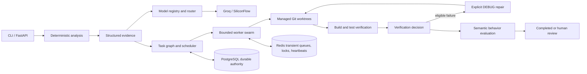

# MigrationSwarm

MigrationSwarm is an experimental multi-agent Java modernization system. It
combines deterministic repository analysis, structured model reasoning, isolated
Git worktrees, durable scheduling, bounded repair, multi-service orchestration,
technical verification, and semantic behavior evaluation.

It is an open-source release candidate for experimentation and teaching, not a
production migration platform.

## Why MigrationSwarm

Sending a whole monolith to an LLM and accepting generated code does not provide
reliable evidence about ownership, dependencies, buildability, or behavior. A
safer migration workflow separates deterministic facts from bounded reasoning:

```text
deterministic analysis
        ↓
structured evidence
        ↓
AI reasoning through capability-aware routing
        ↓
task DAG and approvals
        ↓
isolated code changes in managed worktrees
        ↓
build and test evidence
        ↓
deterministic verification
        ↓
bounded semantic behavior evaluation
        ↓
human review when evidence is insufficient
```

The main repository remains read-only during code-changing workflows. The
system never commits, pushes, or claims that a passing build proves production
correctness.

## Current Capabilities

- deterministic repository inventory, Java dependency, and architecture analysis
- grounded service-boundary reasoning and migration planning
- provider-neutral capability routing for Groq and SiliconFlow
- explicit service approvals and dependency-aware task DAGs
- PostgreSQL-authoritative durable task, run, and event state
- Redis transient queues, locks, and heartbeats
- bounded worker and verification-worker pools
- isolated Git worktrees for code-changing tasks
- copy-first service extraction and allowlisted Maven/Gradle verification
- explicit bounded `DEBUG` repair tasks
- single-service and multi-service orchestration
- security controls for paths, symlinks, secrets, subprocesses, and artifacts
- benchmark, observability, recovery, and release-validation infrastructure
- typed semantic behavior contracts with allowlisted normalization
- bounded local performance characterization

PostgreSQL and Redis are optional for offline demonstrations and unit tests.
External integration remains environment-dependent.

## Architecture



PostgreSQL is the durable source of truth for projects, tasks, runs, events,
and agent executions. Redis contains transient coordination state only. Redis
does not replace durable task state, and `VERIFYING` is not `COMPLETED`.

## Safety Model

- The main repository is not modified by code-changing orchestration.
- Managed task worktrees isolate generated files and repairs.
- Model output, repositories, artifacts, and subprocess output are untrusted.
- Path traversal and symlink escapes are rejected.
- Shell execution is allowlisted, bounded, and uses `shell=False`.
- Model responses, artifacts, and logs have explicit size limits.
- Retries and repair attempts are finite; there are no invisible retries.
- No automatic commit, push, reset, cleanup, or pull request is performed.
- Cycles, foreign repository access, and cross-domain writes can require
  `HUMAN_REVIEW`.
- Technical extraction success and semantic behavior success are separate.
- Recovery is conservative and inspect-only; it never replays work automatically.

See [docs/security.md](docs/security.md) for the current threat model and
residual limitations.

## Quick Start

The first successful experience is offline and requires no API credentials.

```powershell
python -m venv .venv
.\.venv\Scripts\Activate.ps1
python -m pip install --upgrade pip
python -m pip install --editable ".[dev]"

migrationswarm --version
migrationswarm doctor
migrationswarm config-check
migrationswarm demo ./examples/demo-commerce-monolith --offline
migrationswarm benchmark --all
migrationswarm security-check
migrationswarm release-check --skip-expensive --skip-soak
```

On Unix-like shells, activate the environment with `source .venv/bin/activate`.
The demo and benchmark use deterministic offline responses; Docker, PostgreSQL,
Redis, and provider credentials are not required for this path.

To run the API locally:

```powershell
uvicorn migrationswarm.api.main:app --reload
```

The health endpoint is `GET http://127.0.0.1:8000/health`.

For packaging validation:

```powershell
python scripts/validate_clean_install.py
```
## How MigrationSwarm Differs

MigrationSwarm is an experimental Java/Spring Boot modernization system focused not only on identifying service boundaries, but on executing and validating the migration workflow end to end.

Existing tools such as IBM Mono2Micro focus primarily on decomposing monolithic Java applications and recommending candidate microservice boundaries using static and runtime analysis.

MigrationSwarm explores a complementary approach built around orchestration and verification:

- deterministic repository and dependency analysis
- LLM-assisted service-boundary reasoning
- explicit task DAGs and multi-worker execution
- isolated Git worktrees for code-changing operations
- automated service extraction
- real Maven build and test verification
- bounded debug and repair loops
- semantic behavior validation
- fail-closed handling when evidence is incomplete
- human-review escalation for unsafe or ambiguous decompositions

The goal is not to claim automatic correctness or replace architectural judgment. MigrationSwarm treats modernization as an evidence-driven workflow where model-generated decisions must survive deterministic checks, builds, tests, and behavioral validation before being accepted.

### Positioning

| Capability | MigrationSwarm | Typical decomposition tools |
|---|---|---|
| Service-boundary discovery | Yes | Yes |
| Static dependency analysis | Yes | Yes |
| LLM-assisted reasoning | Yes | Varies |
| Automated code extraction | Yes | Varies |
| Git-isolated transformation | Yes | Typically not a core focus |
| Build/test verification | Yes | Varies |
| Bounded automated repair | Yes | Typically not a core focus |
| Semantic behavior checks | Yes | Varies |
| Human-review fallback | Yes | Varies |
| Multi-worker orchestration | Yes | Typically not a core focus |

MigrationSwarm should therefore be viewed as a research-oriented modernization execution and verification system rather than only a microservice-boundary recommendation tool.

## Evaluation

The benchmark contains four local Spring Boot/Maven fixtures:

- Commerce: ordinary order, inventory, customer, and notification boundaries.
- Support: ticket, user, and notification boundaries.
- Booking: reservation, payment, and notification boundaries.
- Fulfillment: deliberately unsafe dependency structure.

The newest normal benchmark artifact records:

- boundary precision: `1.0`
- boundary recall: `1.0`
- boundary F1: `1.0`
- 10 services extracted, built, tested, and technically verified
- 15 semantic contracts defined
- 10 semantic contracts executed
- 10 semantic contracts passed
- 0 semantic contract failures
- 5 contracts unavailable because Fulfillment was intentionally blocked

These are bounded measurements on four local fixtures. They are not production
accuracy, scalability, or business-correctness claims. See
[docs/evaluation.md](docs/evaluation.md) for denominators and methodology.

## Fulfillment Safety Case

Fulfillment intentionally stresses cyclic service dependencies, foreign
repository access, shared domain objects, and cross-domain transactional
behavior. MigrationSwarm does not fabricate a safe extraction. The fixture is
reported as `review_required` and its semantic status is `not_evaluated` because
the workflow stops before a trustworthy generated service exists.

This is a core design example: uncertainty is surfaced for review rather than
converted into a misleading success.

## Performance

The newest recorded local performance artifact is written under
`artifacts/performance/<run-id>/`:

| Configuration | Duration | Speedup |
| --- | ---: | ---: |
| sequential 1/1/1 | 41,359 ms | 1.0000x |
| parallel-2 2/2/1 | 28,782 ms | 1.4370x |
| parallel-3 3/2/2 | 30,328 ms | 1.3637x |

These are local fixture measurements. Maven dominates much of the runtime, the
fixture dependency graph limits useful concurrency, and filesystem/CPU state
can change the result. They are not enterprise scalability claims. Earlier
measurements are consistent with the same limit: only two services were observed
concurrently in some runs, so the third service worker could not create additional
useful work.

Run the bounded characterization with:

```powershell
migrationswarm perf --offline
```

See [docs/performance.md](docs/performance.md).

## Live Providers

MigrationSwarm includes synchronous Groq and SiliconFlow OpenAI-compatible
integrations. The `ModelRegistry` owns provider model IDs, and the router selects
models by capability. Same-provider candidates are preferred. Cross-provider
fallback is disabled by default and requires
`MODEL_ALLOW_CROSS_PROVIDER_FALLBACK=true`.

Provider credentials are optional for offline work and are loaded only through
settings. Use `migrationswarm models` to inspect safe configuration and
eligibility metadata. Use `migrationswarm model-check PROVIDER` only when an
explicit live provider check is intended; provider health, quotas, latency, and
network availability are not guaranteed by the offline benchmark.

## PostgreSQL and Redis

PostgreSQL is the durable authority for projects, tasks, runs, events, and agent
executions. Redis is transient coordination for ready queues, locks, and
heartbeats. Migrations are explicit and are not run automatically at startup.

```powershell
docker compose up -d postgres redis
migrationswarm db-upgrade
migrationswarm db-status
migrationswarm redis-status
```

External PostgreSQL integration is conditional in the test suite. External
Redis runtime validation is not required for unit tests because fakeredis is
used. Neither service is claimed to be externally production-validated by this
repository.

## Limitations

- The system is focused on Java/Spring Boot repositories.
- Java analysis is a lightweight source parser, not a full `javac` semantic model.
- Behavior contracts cover bounded observable behavior, not formal equivalence.
- Database decomposition and deployment are out of scope.
- External provider quotas, credentials, and network failures can interrupt live runs.
- PostgreSQL and Redis external integration remains environment-dependent.
- Human review remains necessary for ambiguous or unsafe dependency structures.
- This release candidate makes no unattended production-migration claim.

## Documentation

- [Architecture](docs/architecture.md)
- [Evaluation](docs/evaluation.md)
- [Current status](docs/status.md)
- [Design decisions](docs/design-decisions.md)
- [Interview guide](docs/interview-guide.md)
- [Security](docs/security.md)
- [Performance](docs/performance.md)
- [Releasing](docs/releasing.md)
- [Contributing](CONTRIBUTING.md)
- [Agent orientation](AGENTS.md)
