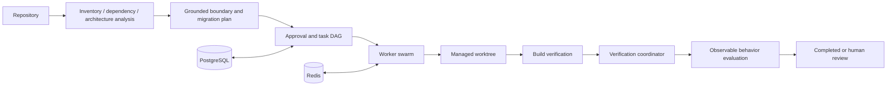
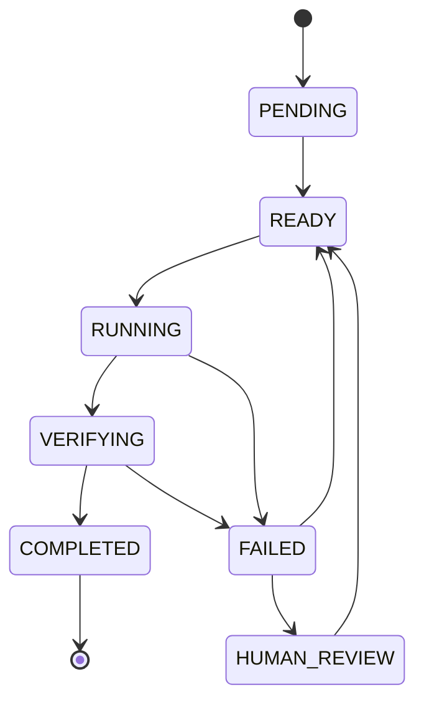
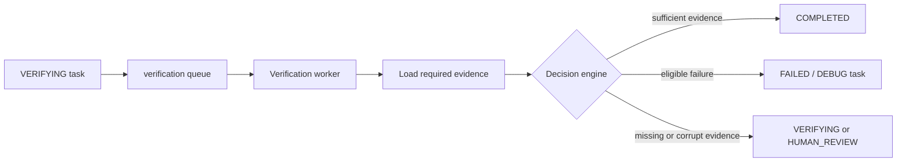
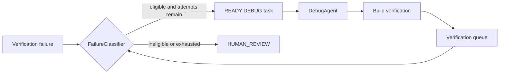
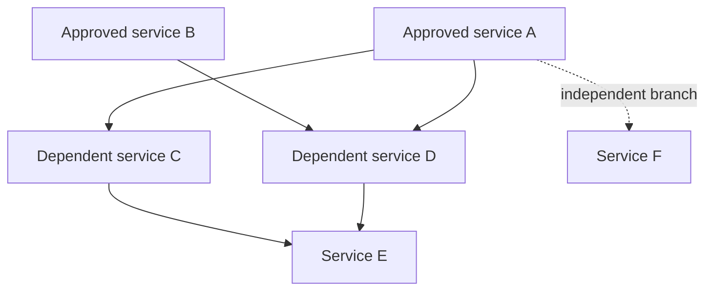

# Architecture

MigrationSwarm is a bounded orchestration system for Java/Spring Boot
modernization. It turns repository evidence into approved, isolated, and
verifiable service-extraction work. It is not an autonomous migration loop.

## 1. System goals

The system is designed to make migration decisions inspectable:

1. discover repository facts deterministically;
2. use bounded model reasoning only where interpretation is needed;
3. represent work as durable tasks with explicit dependencies;
4. isolate code changes in managed Git worktrees;
5. verify technical evidence separately from semantic behavior; and
6. stop for human review when the evidence does not support safe continuation.

## 2. Deterministic versus AI responsibilities

Deterministic components own repository inventory, source-level Java dependency
edges, NetworkX metrics, DAG validation, ownership findings, lifecycle
transitions, subprocess policy, evidence validation, and benchmark metrics.

Model-assisted components receive bounded, structured evidence. They propose
service boundaries, migration plans, or constrained file changes through the
provider-neutral `ModelRouter`. Provider model IDs remain centralized in the
`ModelRegistry`; agents do not call providers directly.

## 3. Task state machine

The lifecycle is centralized in `core/tasks/state_machine.py`:

`COMPLETED` is terminal. Retries increment the durable attempt count and are
bounded by `max_attempts`; exhausted work requires `HUMAN_REVIEW`.

## 4. TaskGraph and scheduling

`core/scheduler/graph.py` stores task IDs and direct dependency edges in memory.
It rejects duplicate tasks, unknown dependencies, self-dependencies, and
cycles. Topological ordering is deterministic. The graph observes lifecycle
state but never mutates it.

`TaskScheduler` finds `PENDING` tasks whose direct dependencies are all durable
`COMPLETED`, then promotes them through `TaskStateMachine`. Independent roots
can become `READY` in the same scheduling tick. Dependents never unlock merely
because a worker reached `VERIFYING`.

## 5. Worker swarm

`WorkerRuntime` provides the provider-independent execution contract. It claims
a `READY` task, validates the assigned agent and capability, moves the task to
`RUNNING`, executes synchronously inside the current worker boundary, and moves
successful work to `VERIFYING` or failures to `FAILED`.

The durable worker layer re-reads task state from PostgreSQL, uses owner-token
locks, and runs only within configured local bounds. The dispatcher owns ready
task discovery and enqueueing; workers do not infer dependency readiness.

## 6. Verification workers

Build verification is a separate read-only step. It runs only an internally
selected Maven or Gradle `test` command with `shell=False`, a timeout, and
bounded summaries. Complete logs and structured evidence live outside the task
worktree. Verification workers load that evidence and call the deterministic
`VerificationCoordinator`.

## 7. DEBUG repair tasks

Repair is explicit durable work on the separate `migrationswarm:debug-tasks`
queue. `FailureClassifier` admits only compilation, generated-configuration,
and test failures. `DebugAgent` receives bounded failure evidence and extracted
files, writes only safe text/source changes in the managed worktree, and never
completes verification directly.

The configured repair bound is finite. Repairs are recorded with stable attempt
metadata and never become invisible retries.

## 8. PostgreSQL authority and Redis role

PostgreSQL is the durable authority for projects, tasks, runs, events, agent
executions, repair attempts, and verification decisions. Alembic migrations are
committed and applied explicitly with `migrationswarm db-upgrade`.

Redis is transient coordination only: ready queues, verification queues, DEBUG
queues, owner-token locks, and expiring heartbeats. Losing Redis must not turn
transient queue state into the durable task record. External database and Redis
validation is environment-dependent; unit tests use SQLite and fakeredis where
appropriate.

## 9. Worktree isolation

`GitWorktreeManager` owns only `.migrationswarm/worktrees/`. Every code-changing
task receives a clean managed worktree. The original application source is not
passed as a writable workspace, and generated services are copy-first. The
orchestrator preserves worktrees for inspection and never commits, pushes, or
uses destructive Git commands on the main repository.

## 10. Single-service orchestration

`MigrationOrchestrator` coordinates one approved candidate:

1. inspect grounded artifacts;
2. create a managed worktree;
3. extract only the selected service files;
4. run safe subproject build verification;
5. evaluate deterministic evidence; and
6. preserve artifacts and worktree state for review.

It delegates to analysis, extraction, build, repair, and verification
components instead of duplicating their logic.

## 11. Multi-service orchestration

`MultiServiceMigrationOrchestrator` accepts explicitly approved candidates and a
dependent-to-prerequisite service DAG. Independent services may run within the
bounded service-worker limit. A dependent starts only after every prerequisite
is `COMPLETED`. Failed branches block descendants while unrelated branches
continue. Cycles and missing prerequisites are review conditions, not guessed
orders.

## 12. Approval model

Service approvals are explicit human-controlled metadata under
`.migrationswarm/service-approvals.json`. The system never populates approvals
automatically. Approval does not bypass dependency, ownership, build, or
semantic checks.

## 13. Failure isolation

Each service branch has its own task worktree and bounded artifacts. A failed
branch does not erase unrelated completed branches. Missing evidence remains
insufficient evidence; it is not converted to success. The recovery command is
read-only and reports state for manual intervention rather than replaying work.

## 14. Semantic evaluation

The evaluation layer compares typed, fixture-declared observable contracts:
outputs and statuses, errors, state transitions, ordered side effects, API
routes, DTO shapes, validation rules, and consumer/provider contracts. Only
allowlisted normalization, such as timestamps or request IDs, is applied.

These adapters measure bounded observable preservation. They are not formal
semantic equivalence, a proof of business correctness, or a replacement for
the fixture Maven test suite.

## 15. Recovery philosophy

Recovery is conservative and inspect-only. `recovery-status` can inspect durable
tasks, locks, heartbeats, and preserved worktrees. It does not reset state,
delete worktrees, requeue tasks, retry providers, commit, or push. Operators
decide how to resume after reviewing evidence.

## 16. Security boundaries

Repositories, model output, logs, artifacts, environment configuration, and
subprocess output are untrusted. Path containment, symlink checks, response and
artifact limits, secret redaction, allowlisted commands, bounded timeouts, and
atomic writes reduce the attack surface. This is a local teaching and
evaluation harness, not a formal security certification.

## 17. Limitations

MigrationSwarm targets Java/Spring Boot and uses a lightweight source parser,
not a full compiler semantic model. Database decomposition, deployment, and
production traffic validation are out of scope. Live provider quotas and
external PostgreSQL/Redis availability can interrupt runs. Human review remains
required when the evidence does not support safe continuation.
